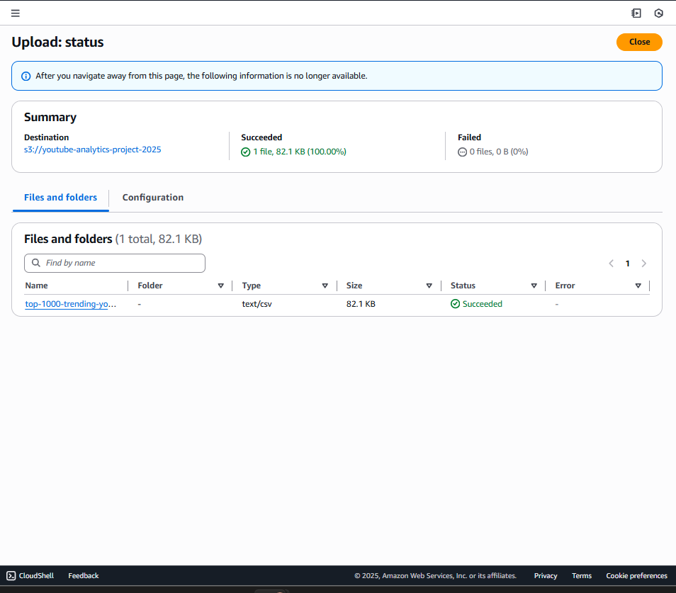
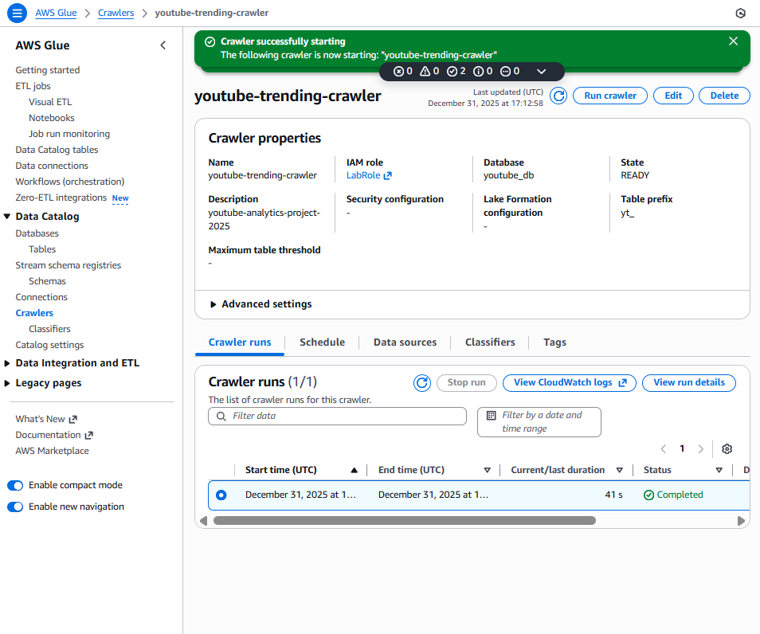
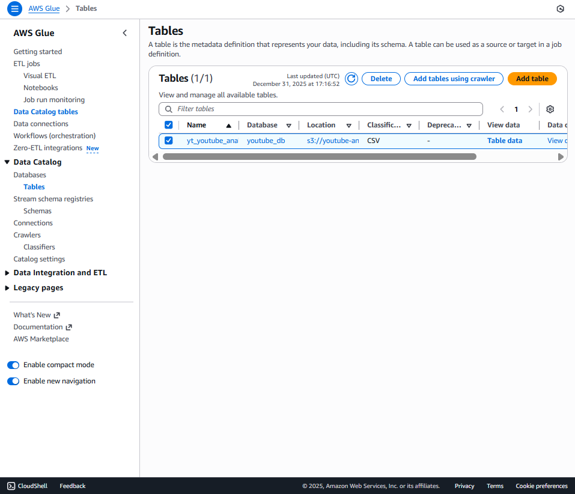
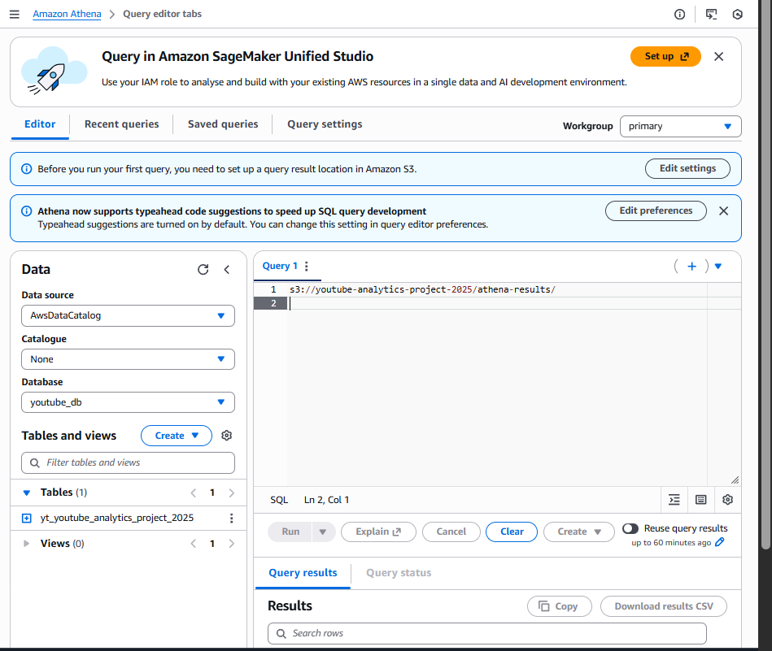
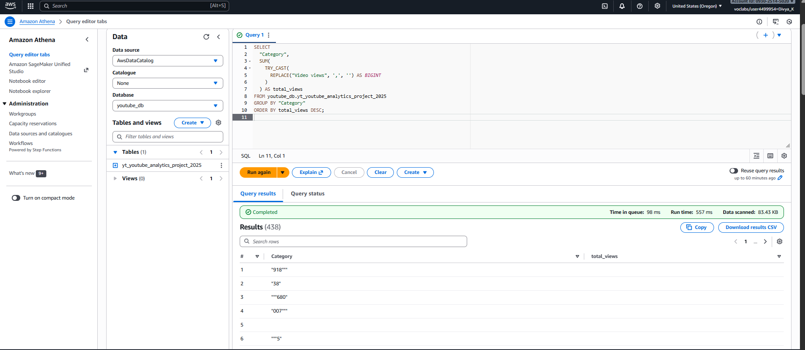
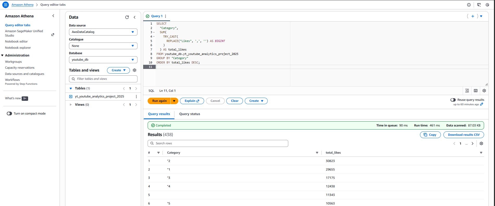
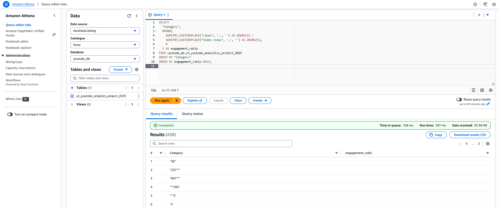
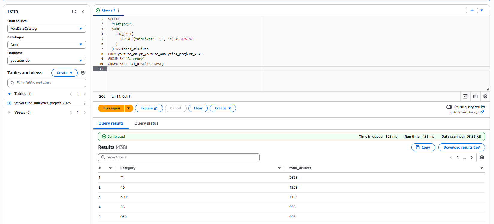
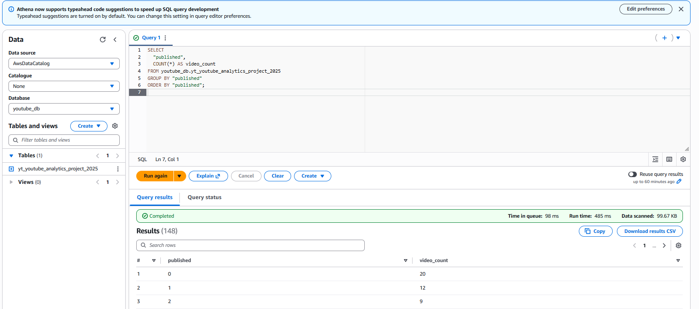

# 📊 YouTube Trending Analytics Pipeline using AWS

## 🔹 Project Overview
This project demonstrates an end-to-end serverless data analytics pipeline on AWS to analyze YouTube trending video data. The goal is to identify top-performing categories, audience engagement, and yearly trends using cloud-native analytics services.

---

## 🔹 Architecture
Amazon S3 → AWS Glue Crawler → AWS Glue Data Catalog → Amazon Athena → (Optional) Amazon QuickSight

> Lambda and Glue Jobs are shown in the architecture diagram as future enhancements for automation and preprocessing.

---

## 🔹 Dataset Details
**Columns:**
- rank  
- Video  
- Video views  
- Likes  
- Dislikes  
- Category  
- published  

**Data Challenges Handled:**
- Numeric values stored as strings
- Comma-separated numbers (e.g., "3,471,237")
- Missing values in Category and Dislikes columns

---

## 🔹 Step-by-Step Implementation

### ✅ Step 1: Upload Data to Amazon S3
- Created an S3 bucket to store raw CSV data
- Uploaded YouTube trending dataset

---

### ✅ Step 2: Create AWS Glue Crawler
- Configured Glue Crawler to scan S3 bucket
- Automatically detected schema and column types
- Stored metadata in Glue Data Catalog

📸 Screenshot:

---

### ✅ Step 3: Verify Table in Glue Data Catalog
- Confirmed database creation (`youtube_db`)
- Verified table and column schema

📸 Screenshot:

---

### ✅ Step 4: Query Data using Amazon Athena
- Connected Athena to Glue Data Catalog
- Set query result location in S3
- Executed SQL queries for analytics
- Handled dirty data using `REPLACE()` and `TRY_CAST()`

📸 Screenshot:

---

### ✅ Step 5: Analytical Queries Performed

#### 🔸 Total Views by Category
sql
SELECT
  "Category",
  SUM(TRY_CAST(REPLACE("Video views", ',', '') AS BIGINT)) AS total_views
FROM youtube_db.yt_youtube_analytics_project_2025
GROUP BY "Category"
ORDER BY total_views DESC;

📸 Screenshot:

#### 🔸 Total Likes by Category
sql
SELECT
  "Category",
  SUM(TRY_CAST(REPLACE("Likes", ',', '') AS BIGINT)) AS total_likes
FROM youtube_db.yt_youtube_analytics_project_2025
GROUP BY "Category"
ORDER BY total_likes DESC;

📸 Screenshot:

#### 🔸 Engagement Ratio (Likes / Views)
sql
SELECT
  "Category",
  ROUND(
    SUM(TRY_CAST(REPLACE("Likes", ',', '') AS DOUBLE)) /
    SUM(TRY_CAST(REPLACE("Video views", ',', '') AS DOUBLE)),
    4
  ) AS engagement_ratio
FROM youtube_db.yt_youtube_analytics_project_2025
GROUP BY "Category"
ORDER BY engagement_ratio DESC;

📸 Screenshot:

#### 🔸 Dislikes Analysis
sql
SELECT
  "Category",
  SUM(TRY_CAST(REPLACE("Dislikes", ',', '') AS BIGINT)) AS total_dislikes
FROM youtube_db.yt_youtube_analytics_project_2025
GROUP BY "Category"
ORDER BY total_dislikes DESC;

📸 Screenshot:

#### 🔸 Trend Analysis by Published Year
sql
SELECT
  "published",
  COUNT(*) AS video_count
FROM youtube_db.yt_youtube_analytics_project_2025
GROUP BY "published"
ORDER BY "published";

📸 Screenshot:

##🔹 Key Insights

- Identified top YouTube categories by views and likes
- Measured audience engagement using engagement ratio
- Observed trends in content publishing over years
- Successfully handled real-world dirty CSV data

## 🔹 Tools & Services Used

- Amazon S3
- AWS Glue
- AWS Glue Data Catalog
- Amazon Athena
- Amazon QuickSight

## 🔹 Key Learnings

- Schema-on-read analytics using AWS Glue and Athena
- Handling string-based numeric data in SQL
- Building serverless analytics pipelines on AWS
- Writing production-ready SQL queries

